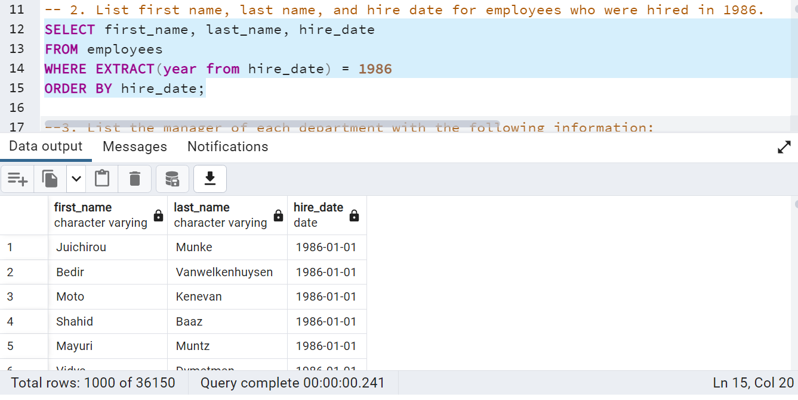

# sql-challenge: Employee Database

## Background

This assignement is to utilize **data modeling**, **data engineering**, and **data analysis** skills to design and create tables to hold data in the CSVs, import the CSVs into a SQL database, and answer questions about the data.

## Initial tasks performed

1. Created a new repository for this project called `sql-challenge`. 

2. Cloned the new repository to my computer.

3. Inside the local Git repository, created a directory for the SQL challenge. Used a folder name that corresponds to this assignment, like `EmployeeSQL`.

4. Added my files to this folder.

5. Pushed these changes to GitHub.

This assignment is divided into three parts: data modeling, data engineering, and data analysis. 

#### Data Modeling

Inspected the CSVs and sketch out an ERD of the tables. Used QuickDBD to create the ERD diagram for the `Employee database` with six tables. 

#### Data Engineering

* Used the provided information to create a table schema for each of the six CSV files. Specified data types, primary keys, foreign keys, and other constraints.

  * For the primary keys, verified that the column is unique. Otherwise, created a `composite key`, which takes two primary keys to uniquely identify a row.

  * Created tables in the correct order to handle the foreign keys.

* Imported each CSV file into the corresponding SQL table. 

#### Data Analysis

After ctreating the database, performed the below SQL queries:

1. List the following details of each employee: employee number, last name, first name, sex, and salary.

2. List first name, last name, and hire date for employees who were hired in 1986.

3. List the manager of each department with the following information: department number, department name, the manager's employee number, last name, first name.

4. List the department of each employee with the following information: employee number, last name, first name, and department name.

5. List first name, last name, and sex for employees whose first name is "Hercules" and last names begin with "B."

6. List all employees in the Sales department, including their employee number, last name, first name, and department name.

7. List all employees in the Sales and Development departments, including their employee number, last name, first name, and department name.

8. List the frequency count of employee last names (i.e., how many employees share each last name) in descending order.

## Bonus

## Create Data visualizations: 

1. Imported the SQL database into Pandas.  

    * Created `.gitignore` file to exclude `config.py` in uploading to GitHub repository.
    
2. Created a histogram to visualize the most common salary ranges for employees.

3. Created a bar chart of average salary by title.

## Deliverables

Below listed four files are available in `sql-challenge\EmployeeSQL` folder.

  * Created an image file `EmployeeDB_ERD.png` for ERD  
  * Created a `EmployeeDB.sql` file for table schemata.
  * Created a `Employee_Queries.sql`file for the queries.
  * Created a Jupyter notebook called `SQL_BONUS.jpynb` for the bonus analysis.

* All `.png` files are available in `sql-challenge\EmployeeSQL\Images` folder.
 
**Created and uploaded the repository with the above files to GitHub and posted a link on BootCamp Spot.

**Ensured that the repository has regular commits and a thorough README.md file
